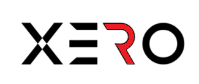
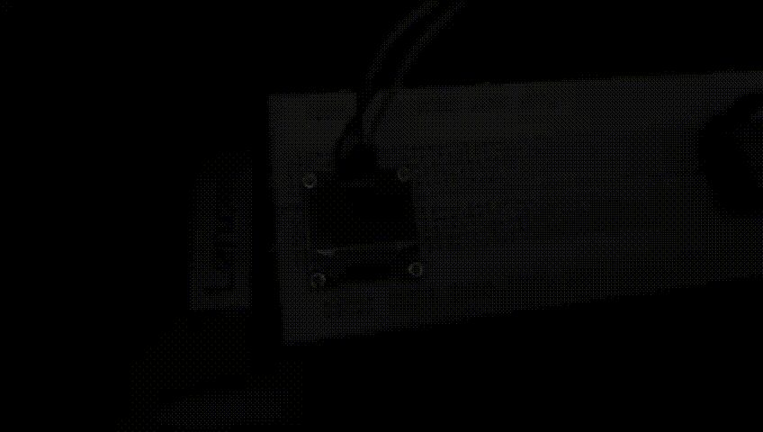

# XERO

Welcome to the XERO project repository!

## Overview

XERO is a digital pet made with ESP32 module with SSD1306 oled display. It is inspired by [DASAI MOCHI V2](https://dasai.com.au/pages/mochi-global).

## Products & Requirements

- 🛒 **ESP32 MODULE**: [Amazon India Link (NOT AFFILIATED)](https://amzn.eu/d/beWduWT)
- 🖥️ **SSD1306 DISPLAY**: [Amazon India Link (NOT AFFILIATED)](https://amzn.eu/d/cUM6rOB)
- 📥 **DRIVER**: [DOWNLOAD AND INSTALL](https://www.silabs.com/developers/usb-to-uart-bridge-vcp-drivers?tab=downloads)
- 💻 **ARDUINO**: [DOWNLOAD AND INSTALL](https://www.arduino.cc/en/software)
- 🛠️ **SETUP**: [FOLLOW THIS SETUP VIDEO](https://youtu.be/jIQSlYtGWTI?si=zVSgMWec_HEFtHW7)

## Codes

You can find the source code for XERO in the following directories:

- 📂 `/CODES/` - Contains the main source code for the XERO project.

## Preview

Here's a sneak peek of what XERO looks like:

## Contributing

We welcome contributions! If you'd like to contribute to XERO, please check out our [Contributing Guidelines](CONTRIBUTING.md) for more information.

## License

This project is licensed under the [MIT License](LICENSE).

---

If you find XERO interesting, please consider giving it a star ⭐ and forking it 🍴 to show your support!

Feel free to reach out to us with any questions or feedback. Happy coding!
